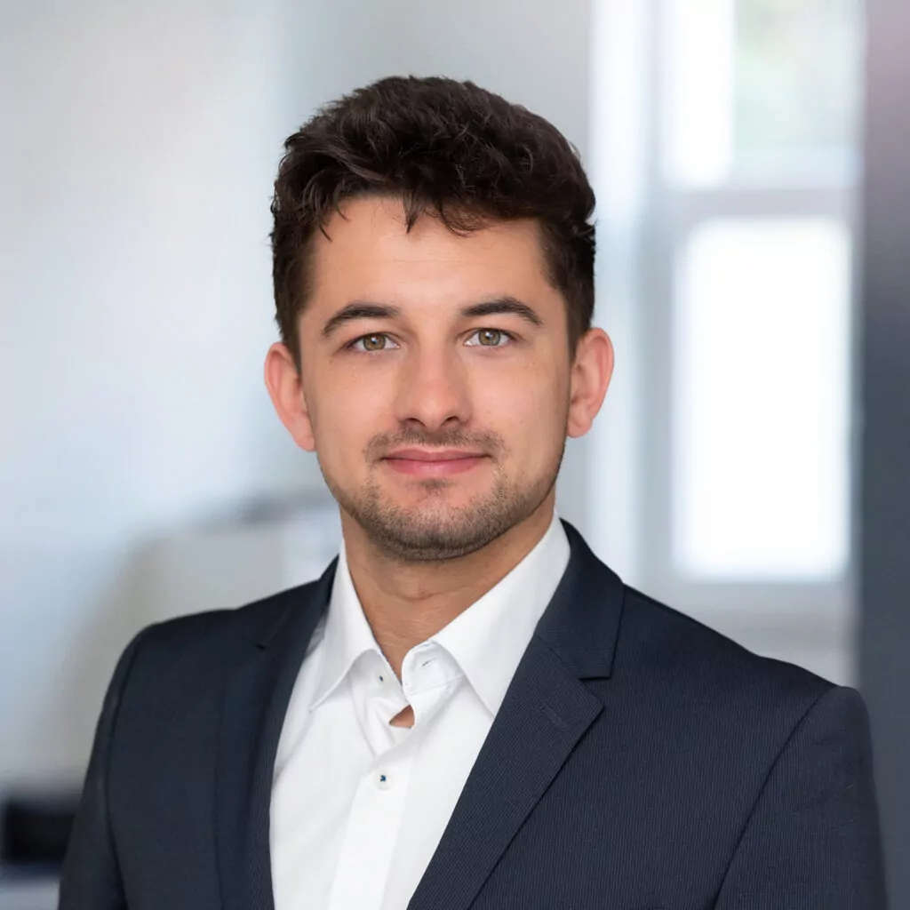
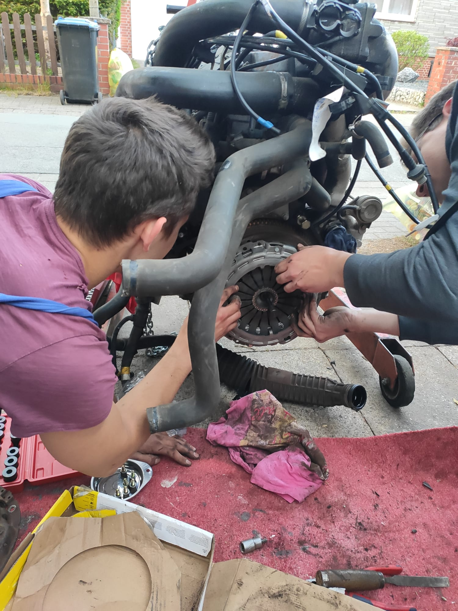
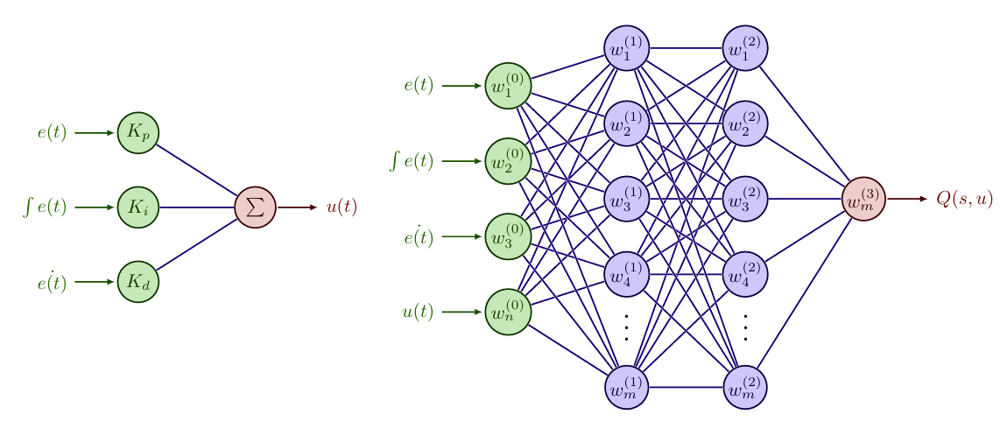
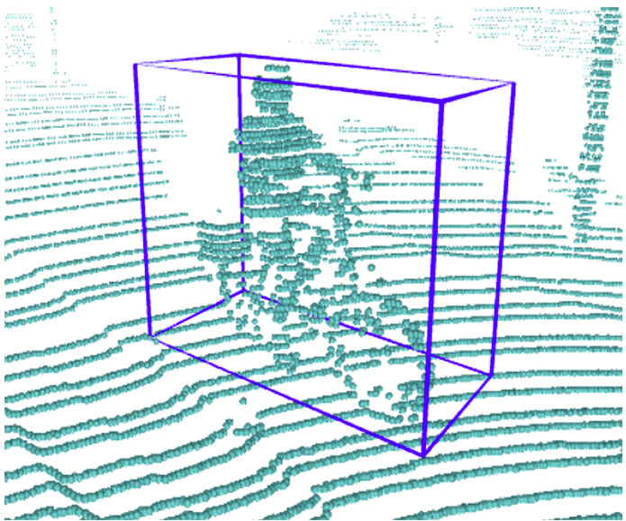
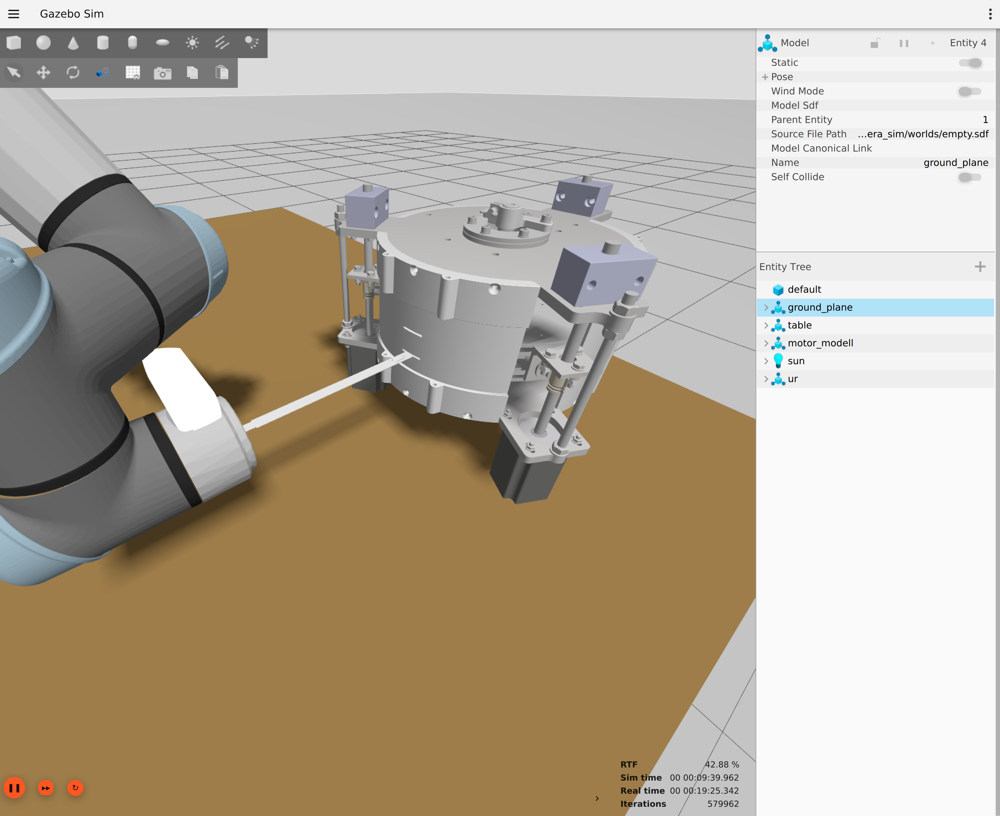
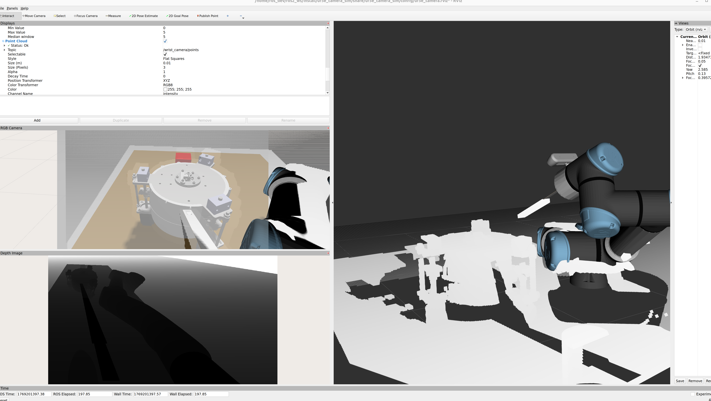
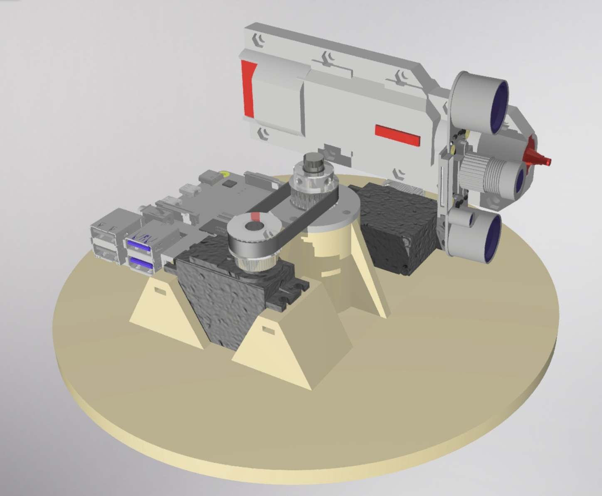
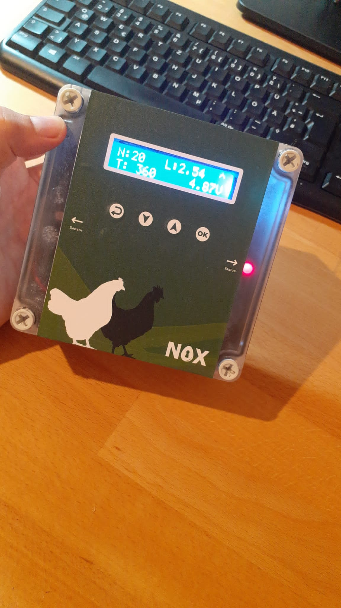
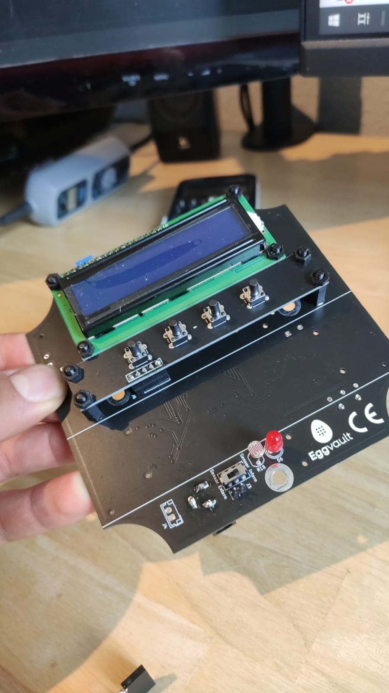
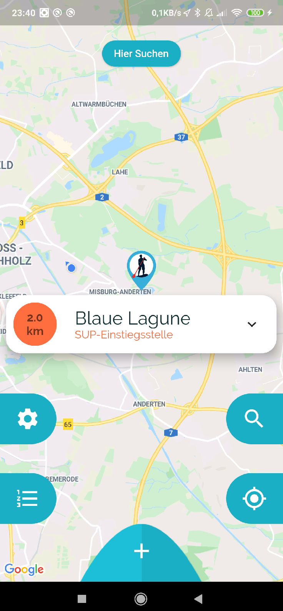

  
  

    <h1 style="margin: 0;">Simon Pauka</h1>
    <h2 style="color: #666; margin: 0.5rem 0;">Mechatronics & Robotics Engineer</h2>
    

      <a href="mailto:simon.pauka@gmail.com">simon.pauka@gmail.com</a> | 
      <a href="https://linkedin.com/in/simon-pauka-053406154">LinkedIn</a> | 
      <a href="https://github.com/paku2k">GitHub</a>
    

  

---

## About Me

I've always been interested in technology, from joining a robotics team and building my own LEGO Robots as a kid to working on my campervan's engine. This interest led me to study mechatronics and robotics, where I can combine mechanical engineering, electronics, and software development.

I'm a mechatronics engineer with 6 years experience in the commercial vehicle industry, focusing on autonomous systems and machine learning. I enjoy working on projects that connect theoretical concepts with practical applications.

---

## Academic Research

### Master's Thesis: Reinforcement Learning for Controller Optimization

For my master's thesis, I worked on reinforcement learning approaches for control applications. I developed three RL methods using shallow actor and deep critic networks, which were validated in different simulations.

### Research Project: Object Detection in Point Clouds

I worked on object detection algorithms for point cloud data from RADAR and LIDAR sensors. This project helped me develop skills in computer vision and sensor fusion.

---

## Current Research

### Institute for Integrated Production (IPH)

I'm currently working on [automation of manipulation tasks](https://www.iph-hannover.de/en/press/press-releases/index.php?we_objectID=6905) using computer vision and robotics. My work focuses on:

  

    
    <h4>Testing RGB-D Camera Data-Streams in Simulation</h4>
    
Creating simulation environments for testing computer vision strategies before real-world implementation.

  

  

    
    <h4>Multi-view Sensor Data Processing</h4>
    
Developing algorithms for processing data from multiple camera perspectives to enable object recognition and manipulation.

  

---

## Recent Projects

### Bird Detection System

  

    <video width="100%" height="300px" autoplay loop muted playsinline style="border-radius: 8px; object-fit: cover;">
      <source src="videos/bird_detector_1.mp4" type="video/mp4">
      Your browser does not support the video tag.
    </video>
  

  

    
  

<strong>Technologies:</strong> Python, OpenCV, YOLOv8

A bird detection and tracking system using real-time computer vision with an automated pan-tilt mechanism for following detected birds.

<a href="https://github.com/paku2k/bird_detector">View Project on GitHub</a>

### Automated Chicken Door

  

    
  

  

    
  

<strong>Technologies:</strong> Arduino, IoT, Sensors

An automated chicken coop door system that opens and closes based on light conditions, with remote monitoring capabilities.

<a href="https://github.com/paku2k/Eggvault_dev">View Project on GitHub</a>

### SUP Spot Finder App

<strong>Technologies:</strong> Android, Java, GPS

A mobile app that helps stand-up paddleboard enthusiasts find good spots based on weather conditions and user reviews.

<a href="https://github.com/paku2k/sup">View Project on GitHub</a>

---

## Background

### Awards
- Dr. Jürgen and Irmgard Ulderup Award (2026) - Outstanding Master's thesis
- Germany Scholarship (2022-2023) - Federal Ministry of Education and Research
- Best Student Award (2020) - Hochschule Hannover

### Technical Skills
- **Programming:** Python, C/C++, MATLAB/Simulink, Java
- **Robotics:** Computer Vision, SLAM, ROS2, Sensor Fusion
- **AI/ML:** PyTorch, TensorFlow, Reinforcement Learning
- **Hardware:** Arduino, Raspberry Pi, STM32, Embedded Systems
- **Automotive:** CAN Bus, ECU Development

---

## Other Interests

I run a drone photography company called Imageflight and enjoy outdoor activities like volleyball. These experiences outside of engineering often provide fresh perspectives for technical problem-solving.
